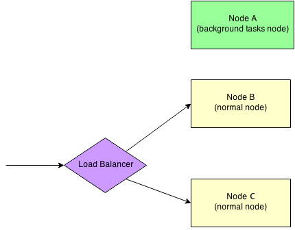

# 集群部署

## <a id="wiki-arch"></a> 架构

Seafile集群方案采用了3层架构：

* 负载均衡层：将接入的流量分配到 seafile 服务器上。并且可以通过部署多个负载均衡器来实现高可用。
* Seafile 服务器集群：一组 seafile 服务器实例。如果集群中的某个实例不可用，负载均衡调度器将停止向其传输流量，以实现高可用。
* 后端存储：分布式存储集群。例如：S3、openstack或ceph。

该架构支持横向扩展。这意味着，您可以通过添加更多的 Seafile 服务器来分担处理流量，架构图如下：


Seafile 服务器节点上有两个主要组件：web 服务(Nginx/Apache)和 Seafile 应用程序服务。web 服务将请求从客户端传递到 seafile 应用程序服务。Seafile 服务器独立工作，它们不知道对方的状态。这意味着集群中某个服务器发生故障不会影响到其他服务器实例。负载均衡服务器负责检测故障和重新分发请求。

即便 Seafile 服务器是独立工作的，它们也必须共享一些会话信息。所有共享的会话信息被保存在 memcached 服务上。因此，所有的 Seafile 服务器必须连接到相同的 memcached 服务器（集群）。稍后可提供有关memcached配置的更多详细信息。

所有的 Seafile 服务器都访问相同的用户数据。这些用户数据包括两部分：一部分存储在 MySQL 数据库中，另一部分存储在后端分布式存储集群中 (S3, Ceph etc.)。所有的应用程序服务器都向客户提供同样的数据。

所有的应用服务器都必须能够连接到相同的数据库或相同的数据库集群。如果需要数据库群集,我们建议使用 mariadb 群集。

部署 Seafile 集群有以下几个步骤：

1. 准备硬件、操作系统、memcached和数据库
2. 部署单个 Seafile 服务器节点（使用seafile安装脚本）
3. 将单节点配置复制到其他 Seafile 服务器节点
4. 配置后端服务
5. 部署负载均衡服务器

## <a id="wiki-preparation"></a>准备工作

### 硬件

至少2台Linux服务器，至少2GB RAM。

假如一个seafile集群中有三个节点：A、B 和 C
* 节点 A 作为后端节点，用来执行后端任务
* 节点 B 和 C 作为前端节点，用来接收来自客户端的请求



### 安装 Python 依赖库

在每个节点上,您需要安装一些python库。

**首先确定您已经安装了 Python 2.7**，然后执行：
```
sudo easy_install pip
sudo pip install boto
```
如果您收到了一条错误信息 "Wheel installs require setuptools >= ...",在上边的pip和boto之间运行它：
```
sudo pip install setuptools --no-use-wheel --upgrade
```

## <a id="wiki-configure-single-node"></a> 部署一个单节点 Seafile 服务器

要确保每一个 Seafile 服务器上的配置文件是一致的。 **不要在每台机器上分别配置seafile服务器,这非常重要。您应该在一台计算机上配置好seafile服务器,然后将配置目录复制到其他计算机。**

### 安装 Seafile

Seafile 专业版的安装过程和社区版相同，建议您使用 Seafile 安装脚本。

### Seafile 安装脚本

安装脚本可以帮助您快速的安装好 Seafile 服务器，并配置好 MariaDB, Memcached, WebDAV, Ngnix 和开机自动启动脚本。

### 使用步骤

安装干净的 Ubuntu 14.04, 16.04 或 CentOS 7 系统，并**做好镜像** (如果安装失败需要还原到镜像)。

切换成 root 账号 (sudo -i)

获取安装脚本

Ubuntu 14.04:
```
wget https://raw.githubusercontent.com/haiwen/seafile-server-installer-cn/master/seafile-server-ubuntu-14-04-amd64-http
```

Ubuntu 16.04（适用于 6.0.0 及以上版本）:
```
wget https://raw.githubusercontent.com/haiwen/seafile-server-installer-cn/master/seafile-server-ubuntu-16-04-amd64-http
```

CentOS 7:
```
wget https://raw.githubusercontent.com/haiwen/seafile-server-installer-cn/master/seafile-server-centos-7-amd64-http
```

运行安装脚本并指定要安装的版本 (5.0.2)

Ubuntu：
```
bash seafile-server-ubuntu-14-04-amd64-http 5.0.2
```

CentOS 7：

```
bash seafile-server-centos-7-amd64-http 5.0.2
```

脚本会让你选择要安装的版本, 按照提示进行选择即可:

* 如果要安装专业版, 需要先将下载好的专业版的包 `seafile-pro-server_VERSION_x86-64.tar.gz` 放到 `/opt/` 目录下
* 如果是安装开源版，安装脚本在执行过程中会检查 **/opt/** 目录下是否有指定版本号的安装包，如果存在则会安装此包，否则会从 Seafile 网站下载。所以，为了避免因下载失败而导致安装中断，您可以提前下载好安装包放到 **/opt/** 目录下。

该脚本运行完后会在命令行中打印配置信息和管理员账号密码，请仔细阅读。(你也可以查看安装日志 /opt/seafile/aio_seafile-server.log)，MySQL 密码在 `/root/.my.cnf` 中。

### 访问测试

访问 http://`<IP of node>`, 输入安装完成时命令行中返回的管理员账号密码，即可访问。

登录管理后台－设置页面，修改 SERVICE_URL 和 FILE_SERVER_ROOT 为当前地址，否则无法上传文件。

至此单机 Seafile 服务已经安装完成，数据库为本地mysql，文件数据存放在本地磁盘目录：/opt/seafile/seafile-data

### 配置为集群服务 
要作为集群部署，还需要对配置文件做一些额外配置。

#### 修改 memcached 配置：
部署为seafile集群时必须要安装使用memcached，配置使用memcached服务器时请一定先阅读参考 ["使用 memcached"](../deploy/add_memcached.md)

```
# 在Ubuntu系统下
vi /etc/memcached.conf

# Start with a cap of 64 megs of memory. It's reasonable, and the daemon default
# Note that the daemon will grow to this size, but does not start out holding this much
# memory
# -m 64
-m 256

# Specify which IP address to listen on. The default is to listen on all IP addresses
# This parameter is one of the only security measures that memcached has, so make sure
# it's listening on a firewalled interface.
-l 0.0.0.0

service memcached restart
```

```
# 在CentOS 7系统下
vim /etc/sysconfig/memcached

PORT="11211"
USER="memcached"
MAXCONN="1024"
CACHESIZE="64"
OPTIONS="-l 0.0.0.0 -m 256"

systemctl restart memcached
```

#### 配置 `seafile.conf`

您需要添加以下配置信息到 `seafile.conf`

```
[cluster]
enabled = true
memcached_options = --SERVER=<IP of memcached node> --POOL-MIN=10 --POOL-MAX=100
```

如果您部署了一个memcached集群，您需要添加所有的memcached服务器地址到 `seafile.conf`,格式如下:

```
[cluster]
enabled = true
memcached_options = --SERVER=<IP of memcached node1> --SERVER=<IP of memcached node2> --SERVER=<IP of memcached node3> --POOL-MIN=10 --POOL-MAX=100 --RETRY-TIMEOUT=3600
```

注意，上面的配置中有一个 `--RETRY-TIMEOUT=3600` 选项，此选项对于处理memcached服务器故障非常重要。在集群中的memcached服务器发生故障后，seafile服务器将在`--RETRY-TIMEOUT`定义的时间内（以秒为单位）停止尝试使用它。此超时设置应该较长时间，以防止seafile频繁重试失败的服务器,这可能导致客户端经常请求错误。

（可选）Seafile服务器也可打开一个指定端口作为负载均衡器做健康状况检测时使用。默认情况下，seafile使用端口11001。可以通过向 `seafile.conf` 添加以下配置来更改此配置项：

```
[cluster]
health_check_port = 12345
```
#### 配置 `seahub_settings.py`

若此前已经配置好使用memcached服务，还需要添加以下配置项到 `seahub_setting.py`。该配置指明Seahub将用户头像保存在数据库中并缓存到memcached，还要将css缓存到本地内存中。如何配置memcached请参考 ["使用 memcached"](../deploy/add_memcached.md)：

```
AVATAR_FILE_STORAGE = 'seahub.base.database_storage.DatabaseStorage'

COMPRESS_CACHE_BACKEND = 'django.core.cache.backends.locmem.LocMemCache'
```

如果启动了缩略图功能，最好将缩略图存储路径设置为 **共享文件路径**，以便于每个节点都可以通过相同的 **共享文件路径** 创建、获取缩略图

```
THUMBNAIL_ROOT = 'path/to/shared/folder/'
```

#### 配置 `seafevents.conf`

在 `seafevents.conf` 中添加以下内容以禁用本地服务器上的文件索引服务,因为文件索引服务应该在专用后台服务器上启动。

```
[INDEX FILES]
external_es_server = true
```

以下是 `[INDEX FILES]` 配置段的部分示例：

```
[INDEX FILES]
enabled = true
interval = 10m
index_office_pdf = true
external_es_server = true
es_host = background.seafile.com
es_port = 9500
```

注意： `enable = true` 应该保持不变。 `es_host = <IP of background node>` 指定后端服务器地址。


#### 切换为远程数据库

首先停止seafile服务

需要在远程数据库里创建3个数据库

```
create database `ccnet_db` character set = 'utf8';
create database `seafile_db` character set = 'utf8';
create database `seahub_db` character set = 'utf8';
```

创建seafile用户，并授权访问以上数据库

```
create user 'seafile'@'' identified by 'seafile';
GRANT ALL PRIVILEGES ON `ccnet_db`.* to 'seafile'@'';
GRANT ALL PRIVILEGES ON `seafile_db`.* to 'seafile'@'';
GRANT ALL PRIVILEGES ON `seahub_db`.* to 'seafile'@'';
```

导入 seahub 的数据表，数据表在单机安装目录下 `seafile-server-laster/seahub/sql/mysql.sql`

另外还需要在seahub_db里新增一张数据表：

```
CREATE TABLE `avatar_uploaded` (`filename` TEXT NOT NULL, `filename_md5` CHAR(32) NOT NULL PRIMARY KEY, `data` MEDIUMTEXT NOT NULL, `size` INTEGER NOT NULL, `mtime` datetime NOT NULL);
```

##### 修改conf目录下的配置

停止seafile，进入conf目录（默认在顶层安装目录下）

`vim ccnet.conf`，修改[Database]配置段如下：

```
[Database]
ENGINE = mysql
HOST = <IP of mysql node>
PORT = 3306
USER = seafile
PASSWD = seafile
DB = ccnet_db
CONNECTIONT_CHARSET = utf8
```

`vim seafile.conf`，修改[database]配置段如下：

```
[database]
type = mysql
host = <IP of mysql node>
port = 3306
user = seafile
password = seafile
db_name = seafile_db
connection_charset = utf8
```

`vim seahub_settings.py`，修改相关数据库配置如下：

```
DATABASES = {
    'default': {
        'ENGINE': 'django.db.backends.mysql',
        'NAME': 'seahub_db',
        'USER': 'seafile',
        'PASSWORD': 'seafile',
        'HOST': '<IP of mysql node>',
        'PORT': '3306'
    }
}
```

`vim seafevents.conf`,修改[DATABASE]配置段如下：

```
[DATABASE]
type = mysql
host = <IP of mysql node>
port = 3306
username = seafile
password = seafile
name = seahub_db
```

再启动seafile服务，调用命令 `seafile-server-latest/reset-admin.sh` 可重置新的管理员账号。

## 配置出多个节点

配置多个单机节点，与之前所描述的单机节点部署相同，使用自动化安装脚本在多个主机上部署seafile服务。并且要确保在每个节点上，`seafile-data/httptemp` 应该指向同一个NFS共享文件。安装完成后，将最先部署的单机节点上的配置文件目录 `conf` 下的所有配置文件复制替换掉刚部署的其他几个节点的配置文件。

## 配置后端服务器(background)

把文件搜素，office预览等后台服务从前端节点迁移到后端节点。

在复制好的某个seafile服务器上做以下配置：

### 安装所需的依赖库（Java,LibreOffice,poppler）

在 Ubuntu/Debian系统下：

```
sudo apt-get install openjdk-7-jre libreoffice poppler-utils python-uno # or python3-uno for ubuntu 14.04+
```

在 CentOS/Red Hat系统下：

```
sudo yum install java-1.7.0-openjdk libreoffice libreoffice-headless libreoffice-pyuno poppler-utils
```

### 修改后端服务器相关配置文件

编辑 **seafevents.conf** 确保以下配置信息 **不存在** ：

```
external_es_server = true
```

编辑 **seahub_settings.py** 添加以下配置信息：

```
OFFICE_CONVERTOR_NODE = True
```

### 修改前端服务器相关配置文件

编辑 **seafevents.conf**, 添加以下配置信息:

```
[INDEX FILES]
external_es_server = true
es_host = <ip of node background>
es_port = 9500
```

编辑 **seahub_settings.py** 添加以下配置信息:

```
OFFICE_CONVERTOR_ROOT = 'http://<ip of node background>'
```

### 启动后端服务

键入以下命令以启动后台节点(注意,需要一个附加命令 `seafile-background-tasks.sh` )。

```
./seafile.sh start
./seahub.sh start-fastcgi
./seafile-background-tasks.sh start
```

关闭后端节点，键入以下命令：

```
./seafile-background-tasks.sh stop
./seafile.sh stop
./seahub.sh stop
```

## 负载均衡配置

### HAproxy

配置示例：`/etc/haproxy/haproxy.cfg`
（假设用于健康状态检测的端口为12345）

```
global
    log 127.0.0.1 local1 notice
    maxconn 4096
    user haproxy
    group haproxy

defaults
    log global
    mode http
    retries 3
    maxconn 2000
    timeout connect 10000
    timeout client 300000
    timeout server 300000

listen seafile 0.0.0.0:80
    mode http
    option httplog
    option dontlognull
    option forwardfor
    cookie SERVERID insert indirect nocache
    server seafileserver01 <ip of frontend node1>:80 check port 12345 cookie seafileserver01
    server seafileserver02 <ip of frontend node2>:80 check port 12345 cookie seafileserver02
```

启动haproxy服务，并测试使用。


