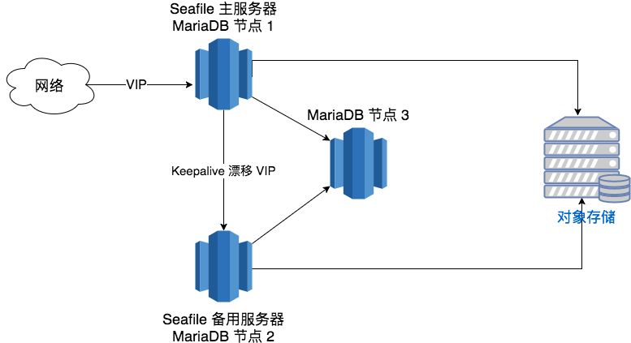

# 基本的 Seafile 高可用集群

本文档介绍用 3 台服务器构建 Seafile 高可用集群的架构。这里介绍的架构仅能实现“服务高可用”，而不能支持通过扩展更多的节点来提升服务性能。如果您需要“可扩展 + 高可用”的方案，请参考[Seafile 可扩展集群文档](deploy_in_a_cluster.md)。

在这种高可用架构中包含3个主要的系统部件：

- Seafile 服务器：提供 Seafile 服务的软件
- MariaDB 数据库集群：保存小部分的 Seafile 元数据，比如资料库所有者、共享关系等
- 文件存储后端：负责保存文件块和元数据

其中，文件存储后端可以是 NAS 或者分布式对象存储，这个存储系统本身的可用性和可靠性不在本文档的讨论范围之内，应该由第三方系统保证。所以我们在这里主要讨论如何实现 Seafile 服务器的高可用，以及 MariaDB 数据库的可用性和可靠性。

## 架构

这种3节点高可用方案的架构图如下：



MariaDB 的高可用和可靠性通过部署 3 节点的 Galera 集群保证。简单地说，Galera 集群是一个针对 MariaDB 的多主（Multi-Master）高可用方案。集群中每个 MariaDB 实例都保存数据库的一个完整副本，客户端可用通过任何一个实例读写数据。这个集群能够在一个节点掉线的情况下继续提供服务，并保证数据一致。这个方案的最大优点是所有对数据库的写入都是严格在三个节点上同步进行的，不存在数据不同步的问题。因此，Seafile 主服务器和备用服务器都只需要直接访问本地的 MariaDB 实例即可。

在正常情况下，Seafile 服务运行在 Seafile 主服务器上，对外提供 Seafile 的所有功能，包括 web 访问、文件同步、搜索、预览等。当主服务器正常工作时，备用服务器上并不运行 Seafile 服务。主备两个服务器上都运行 Keepalived 进程。它负责管理 Seafile 对外提供服务的 IP 地址（虚拟 IP 地址，简称 VIP）。当主服务器正常工作时，它把 VIP 关联在主服务器上，客户端通过主服务器访问 Seafile；当检测到主服务器宕机后，备用服务器上的 Keepalived 进程自动把 VIP 漂移到备用服务器，并自动在上面启动 Seafile 服务。这种模式保证了 Seafile 服务的高可用性。由于数据都是保存在后端存储和 MariaDB 集群中，所以在切换过程中不会出现数据丢失。

## 部署实现

以下我们把 Seafile 主服务器称为 Node1，备用服务器节点称为 Node2，第三个 MariaDB 节点称为 Node3。

### 在 Node1 Node2 Node3 上安装 MariaDB 并配置Galera 集群

MariaDB 集群部署请参考文档 [MariaDB Galera Cluster](https://mariadb.com/resources/blog/setting-mariadb-enterprise-cluster-part-2-how-set-mariadb-cluster)

MariaDB 集群部署成功后在三个节点上执行以下操作，添加MariaDB 集群健康状态检测脚本：

```
wget "https://raw.githubusercontent.com/olafz/percona-clustercheck/master/clustercheck" -O /usr/bin/clustercheck
cd /usr/bin
chmod 755 clustercheck
```

并在任意一个 MariaDB 群节点上为clustercheck用户授权访问数据库：

```
GRANT PROCESS ON *.* TO 'clustercheckuser'@'localhost' IDENTIFIED BY 'clustercheckpassword!';
```

在各节点上执行 `clustercheck` 命令，返回 `'200'`则说明该节点运行正常，返回 `'500'` 则说明该节点不可用。

### 在 Node1 Node2 上安装 Seafile

首先在Node1、Node2上安装Seafile运行所需的依赖库，在两个节点上执行以下命令：

```
yum install python-setuptools python-ldap MySQL-python python-memcached python-urllib3 -y
yum install jre -y
pip install Pillow==4.3.0
pip install moviepy  # 视频文件缩略图需要用到
```

仅在 Node1 上使用 ./setup-seafile-mysql.sh 方式安装 Seafile。假设您已将Seafile专业版6.1.6的安装包下载到 `/opt/` 目录下了。参考以下命令完成安装：

```
cd /opt/
mkdir seafile
tar -xvf seafile-pro-server_6.1.6_x86-64.tar.gz -C seafile
cd seafile/seafile-pro-server-6.1.6
./setup-seafile-mysql.sh auto -u seafile -w ${SQLSEAFILEPW} -r ${SQLROOTPW}
```

*注意：`'${SQLSEAFILEPW}'` 代表的是将要授权seafile用户访问数据库所用的密码，替换成您想要设置的密码即可；`'${SQLROOTPW}'` 代表的是root访问数据库时所用的密码，替换成您自己的数据库root密码即可。

以上过程执行成功后，Node1 上已成功安装 Seafile。接下来将 Node1 上 Seafile 的安装目录（此处为/opt/seafile）下的所有文件打包复制到 Node2 节点。并参照以下文档在 Node1、Node2 上配置好相应的后端存储；

### 配置后端存储

还需要将后端云存储系统的设置添加到配置文件中，这里提供了4种后端存储的配置方案：

* 使用 NFS ：[NFS 下集群安装](setup_seafile_cluster_with_nfs.md)
* 使用 S3：[Amazon S3 下安装](setup_with_amazon_s3.md)
* 使用 OSS：[使用阿里云OSS存储](setup_with_oss.md)
* 使用 Ceph：[Ceph 下安装](setup_with_ceph.md)

当后端存储配置完成后，可以启动 Seafile 服务做访问测试；在 Seafile 安装目录下执行以下操作，启动 Seafile 服务：

```
cd seafile-server-latest
./seafile.sh start # 启动 Seafile 服务
./seahub.sh start [port] # 启动 Seahub 网站（默认运行在8000端口上）
```

*小贴士: 你第一次启动 seahub 时，seahub.sh 脚本会提示你创建一个 seafile 管理员帐号。
服务启动后, 打开浏览器并输入以下地址

```
http://<192.168.1.123>:8000/
```

你会被重定向到登陆页面. 输入管理员用户名和密码即可。

### Nginx 下配置 Seahub

您可能还需要使用 Nginx 反向代理 Seahub；请参照文档 [Nginx 下配置 Seahub](https://manual-cn.seafile.com/deploy/deploy_with_nginx.html) 在 Node1、Node2 节点上配置 Nginx 反向代理服务；

*提示：请在两个节点都设置 Nginx 开机自启动：`systemctl enable nginx.service`

### Keepalived 高可用

该集群架构中，使用 Keepalived 实现 Seafile 服务高可用。当主节点 Node1 正常提供服务时，备用节点应该不启动 Seafile 服务，当主节点服务不可用时，Keepalived 实现 VIP 地址转移，并启动备用节点 Node2 上的 Seafile 服务。
Keepalived 配置示例如下：

Node1 节点：

```
! Configuration File for keepalived

global_defs {
	notification_email {
		root@localhost
	}
	notification_email_from keepalived@localhost
	smtp_server 127.0.0.1
	smtp_connect_timeout 30
	router_id node1
	vrrp_mcast_group4 224.0.100.19
}

vrrp_script chk_mariadb_galera {
	script "/usr/bin/clustercheck && exit 0 || exit 1"
	interval 1
	weight -5
}

vrrp_instance VI_1 {
	state MASTER
	interface eno16777736
	virtual_router_id 14
	priority 100
	advert_int 1
	authentication {
		auth_type PASS
		auth_pass 571f97b2
	}
	virtual_ipaddress {
		192.168.1.18/24 dev eno16777736
	}
	track_script {
		chk_mariadb_galera
	}
	notify_master "/opt/seafile/seafile-server-latest/seafile.sh start && /opt/seafile/seafile-server-latest/seahub.sh start"
	notify_backup "/opt/seafile/seafile-server-latest/seafile.sh stop && /opt/seafile/seafile-server-latest/seahub.sh stop"
}
```

Node2 节点：

```
! Configuration File for keepalived

global_defs {
	notification_email {
		root@localhost
	}
	notification_email_from keepalived@localhost
	smtp_server 127.0.0.1
	smtp_connect_timeout 30
	router_id node2
	vrrp_mcast_group4 224.0.100.19
}

vrrp_script chk_mariadb_galera {
	script "/usr/bin/clustercheck && exit 0 || exit 1"
	interval 1
	weight -5
}

vrrp_instance VI_1 {
	state BACKUP
	interface eno16777736
	virtual_router_id 14
	priority 98
	advert_int 1
	authentication {
		auth_type PASS
		auth_pass 571f97b2
	}
	virtual_ipaddress {
		192.168.1.18/24 dev eno16777736
	}
	track_script {
		chk_mariadb_galera
	}
	notify_master "/opt/seafile/seafile-server-latest/seafile.sh start && /opt/seafile/seafile-server-latest/seahub.sh start"
	notify_backup "/opt/seafile/seafile-server-latest/seafile.sh stop && /opt/seafile/seafile-server-latest/seahub.sh stop"
}
```

启动 Keepalived 服务，并配置开机自启，在浏览器上通过虚拟IP地址访问 Seafile 服务，配置正确的 `SERVICE_URL` 和 `FILE_SERVER_ROOT`；

```
systemctl start keepalived.service
systemctl enable keepalived.service
```
